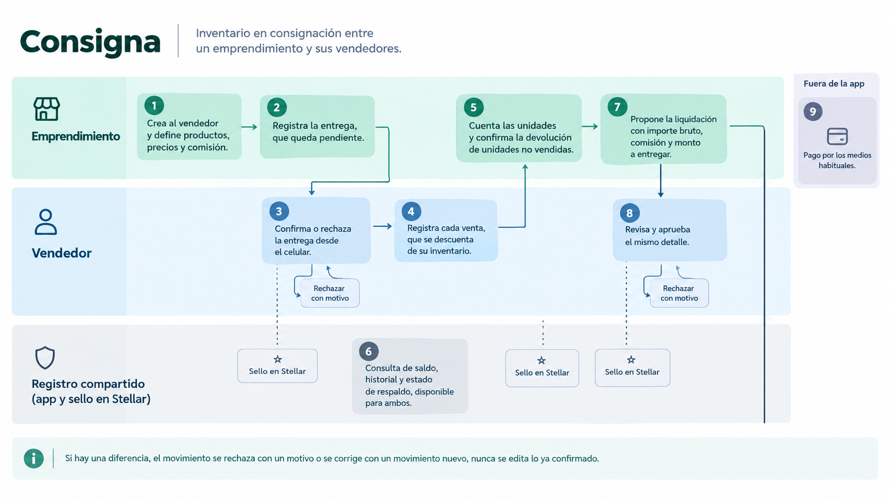
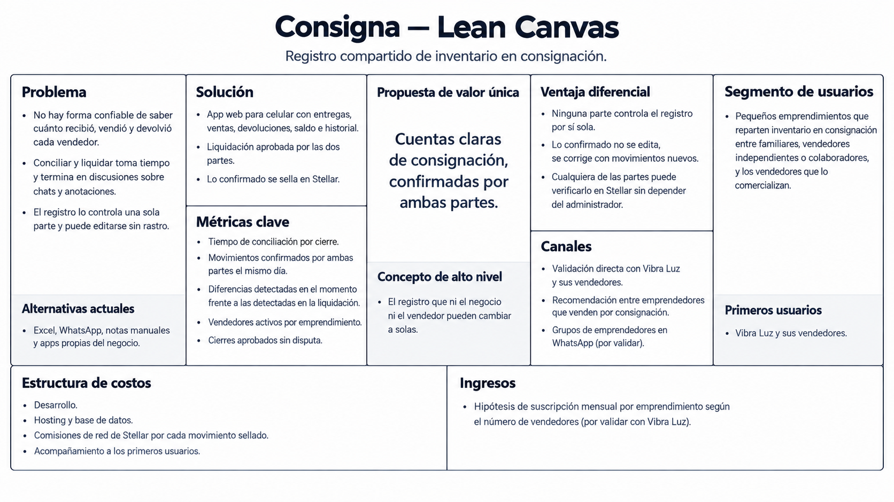
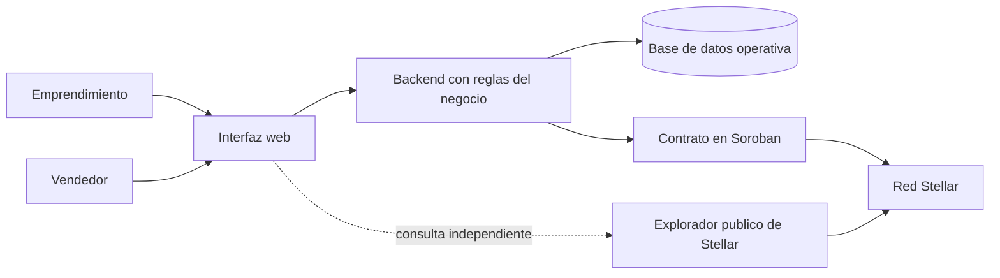

# Product Blueprint

Consigna es un registro compartido de inventario en consignación entre un emprendimiento y sus vendedores. Nuestro caso de validación es Vibra Luz, un emprendimiento familiar de venta de velas.

---

## Priorización de historias

Entre los cuatro escribimos 20 historias de usuario. Varias describen el mismo momento desde lados distintos (la entrega aparece en tres listas y la devolución en dos), así que primero las agrupamos y quedaron 13 historias, más dos habilitadores técnicos que salen del alcance del MVP (acceso por rol y catálogo).

Para priorizar usamos la matriz de cuatro niveles vista en clase, que separa lo central (sin ello el producto no resuelve el problema) de lo secundario (solo mejora la experiencia). Los niveles son imprescindible (sin esto no hay MVP), debería (importante, pero no bloquea), podría (deseable, si sobra tiempo) y queda afuera (no entra en estas semanas).

| Nivel | ID | Historia | Origen |
|---|---|---|---|
| Habilitador | HAB-01 | Acceso por rol y alta de vendedores | Alcance del MVP de Jorge |
| Habilitador | HAB-02 | Catálogo con precio y comisión pactada | Alcance del MVP de Jorge |
| 1 Imprescindible | HU-01 | Registrar la entrega de inventario a un vendedor | Jorge HU-01, Juan Camilo H1 |
| 1 Imprescindible | HU-02 | Confirmar o rechazar una entrega recibida | Jorge HU-02, Juan Camilo H1 |
| 1 Imprescindible | HU-03 | Registrar una venta del inventario consignado | Luis HU-01 |
| 1 Imprescindible | HU-04 | Registrar y confirmar la devolución de unidades no vendidas | Jorge HU-03, Juan Camilo H2 |
| 1 Imprescindible | HU-05 | Consultar saldo e historial de movimientos | Jorge HU-04, Juan Camilo H3 y H5 |
| 1 Imprescindible | HU-06 | Liquidar con base en ventas aceptadas | Jorge HU-05, Juan Camilo H4, Luis (regla de liquidación) |
| 2 Debería | HU-07 | Verificar un movimiento confirmado en Stellar | Luis HU-05, Juan Camilo H5 |
| 2 Debería | HU-08 | Corregir una diferencia con un ajuste, sin modificar el original | Luis HU-03 |
| 2 Debería | HU-09 | Consultar acciones pendientes de confirmación | Luis HU-04 |
| 2 Debería | HU-10 | Reportar pérdidas, daños u otras novedades | Luis HU-02 |
| 3 Podría | HU-11 | Recibir avisos de movimientos pendientes | Jorge (deseable), Luis P1 |
| 3 Podría | HU-12 | Adjuntar evidencia a ventas y novedades | Luis P1 |
| 3 Podría | HU-13 | Consultar reportes por vendedor y periodo | Luis P1, Andrés HU-05 (versión simple) |
| 4 Queda afuera | Sin ID | Historial de compras, historial de clientes, devoluciones por proveedor, trazabilidad de procedencia, analítica del negocio, pagos dentro de la red, transferencias entre vendedores, comisiones por producto y varios negocios en una misma app | Andrés HU-01 a HU-05, Luis P2, Jorge (deseable) |

Criterios que pesaron en la decisión

- Se priorizó el ciclo completo (entrega, venta, devolución, saldo y liquidación), porque es el flujo del Problem Brief y el único que se puede probar de principio a fin con Vibra Luz.
- La liquidación se calcula sobre ventas aceptadas y no sobre entregado menos devuelto, porque esa resta no demuestra que hubo ventas.
- Las cinco historias de Andrés plantean una plataforma comercial más amplia (compras, clientes, proveedores, trazabilidad y rendimiento) que el ciclo de consignación del brief, por eso quedan afuera. Su idea de historial verificable sí está en HU-05 y HU-07.
- Ajustes, bandeja, novedades y verificación detallada son importantes, pero el ciclo funciona sin ellos.

---

## Propuesta de valor

Para un emprendimiento que reparte su inventario entre varios vendedores, y para los vendedores que lo venden, Consigna es un registro compartido donde cada entrega, devolución y liquidación queda confirmada por las dos partes. El usuario principal es quien reparte el inventario, en nuestro caso Vibra Luz, que hoy pierde tiempo reconstruyendo qué pasó con cada producto.

Lo que obtiene el emprendimiento es saber en cualquier momento cuánto tiene cada vendedor, qué vendió y cuánto debe liquidarse, sin conciliar a mano. Si hay una diferencia, aparece cuando ocurre el movimiento y no semanas después, en la liquidación. El vendedor puede comprobar qué aceptó recibir, qué devolvió y qué vendió, y queda protegido frente a reclamos posteriores.

Hoy esto se resuelve con Excel, WhatsApp, notas o una app que administra el propio negocio. Todas guardan información, pero dejan que una sola parte decida qué es válido y permiten editar sin dejar rastro. Elegirían Consigna porque cierran cuentas más rápido y con menos discusión, sin cambiar su forma de trabajar, ya que es una app web que se usa desde el celular.

| Aspecto | Hoy | Con Consigna |
|---|---|---|
| Quién controla el registro | Una sola parte, normalmente el emprendimiento | Ninguna parte por sí sola, los movimientos requieren confirmación de ambas |
| Qué cuenta como válido | Lo que alguien anotó | Solo lo que ambas partes aceptaron |
| Cuando hay una diferencia | Se reconstruye revisando chats y registros | Se ve en el momento y en qué movimiento no coincide |
| Correcciones | Se edita o se borra sin rastro | Se agrega un movimiento nuevo y el original sigue visible |
| Verificación | Depende de confiar en quien administra | Cualquiera de las partes puede comprobar el historial |

---

## Flujo de usuario

En el recorrido intervienen dos personas, el emprendimiento (quien reparte) y el vendedor, y un tercer actor que no es una persona, el registro compartido, que es la app más el sello en Stellar. Cada paso indica quién actúa.

1. **Preparación (emprendimiento).** Crea al vendedor y define productos, precios y la comisión pactada.
2. **Entrega (emprendimiento).** Registra producto, cantidad y fecha. La entrega queda pendiente y no cambia el saldo.
3. **Confirmación (vendedor).** Ve el pendiente en su celular y lo confirma o lo rechaza con un motivo. Al confirmar, el registro compartido sella la entrega con la firma de ambos y el saldo sube.
4. **Venta (vendedor).** Registra cada venta con producto, cantidad y precio. Las unidades se descuentan de su inventario y la venta queda pendiente de liquidar.
5. **Devolución (vendedor y emprendimiento).** El vendedor declara las unidades no vendidas, el emprendimiento las cuenta y las confirma, y el registro compartido sella la devolución.
6. **Consulta (ambos).** En cualquier momento ven el saldo, el historial y el estado de respaldo de cada movimiento en Stellar.
7. **Propuesta de liquidación (emprendimiento).** Revisa las ventas sin liquidar y el sistema calcula el bruto, la comisión y el monto a entregar.
8. **Aprobación y cierre (vendedor).** Revisa el mismo detalle y lo aprueba. Con la aprobación de ambos, el cierre se sella y las ventas quedan liquidadas.
9. **Pago.** Se hace por los medios habituales, fuera de la app en el MVP.

Si hay una diferencia en cualquier paso, el movimiento se rechaza con un motivo o se corrige con un movimiento nuevo. Nunca se edita lo ya confirmado.

---

## Alcance del MVP

El MVP busca que Vibra Luz pueda entregar producto a un vendedor, registrar ventas y devoluciones, y cerrar la liquidación con un registro que las dos partes puedan verificar. Todo en una sola aplicación web que funcione bien en el celular.

**Funcionalidad central (nivel imprescindible)**

- Acceso por rol (emprendimiento y vendedor) y alta de vendedores.
- Catálogo con precio y una tasa de comisión pactada.
- Entrega con confirmación del vendedor (HU-01 y HU-02).
- Registro de ventas (HU-03).
- Devolución con confirmación del emprendimiento (HU-04).
- Saldo e historial con el estado de respaldo en Stellar de cada movimiento (HU-05).
- Liquidación con aprobación de ambas partes y sello del cierre (HU-06).

**Deseable, fuera del MVP**

Si el ciclo completo ya funciona y sobra tiempo, se suman ajustes, bandeja de pendientes, novedades y verificación detallada (nivel debería). Más adelante pueden venir avisos, evidencias y reportes (nivel podría). No entran pagos dentro de la red, transferencias entre vendedores, comisiones por producto, varios negocios en una app ni historial de clientes.

**Por qué el recorte sigue entregando valor**

- Se puede usar de principio a fin, desde la entrega hasta el cierre.
- Resuelve el problema central, que es reconstruir qué recibió, vendió y devolvió cada vendedor.
- Lo que queda fuera mejora la experiencia, pero no es necesario para comprobar que la idea funciona.
- Mantiene la propuesta de valor, porque la verificación sin depender del administrador sigue presente en cada entrega, devolución y cierre.
- Un error descubierto después del sello no tiene ajuste en el MVP y se resolvería fuera de la app. Por eso HU-08 es la primera que se suma.

---

## Lean Canvas

| Bloque | Contenido |
|---|---|
| Problema | No hay forma confiable de saber cuánto recibió, vendió y devolvió cada vendedor. Conciliar y liquidar toma tiempo y termina en discusiones sobre chats y anotaciones. El registro lo controla una sola parte y puede editarse sin dejar rastro. Alternativas actuales, Excel, WhatsApp, notas manuales y apps propias del negocio. |
| Segmento de usuarios | Pequeños emprendimientos que reparten inventario en consignación entre familiares, vendedores independientes o colaboradores, y los vendedores que lo comercializan. Primeros usuarios, Vibra Luz y sus vendedores. A futuro, empresas de venta por catálogo, como hipótesis. |
| Propuesta de valor única | Cuentas claras de consignación, confirmadas por ambas partes. El registro que ni el negocio ni el vendedor pueden cambiar a solas. |
| Solución | App web para celular con entregas, ventas, devoluciones, saldo e historial y liquidación aprobada por las dos partes. Lo confirmado se sella en Stellar. |
| Canales | Validación directa con Vibra Luz y sus vendedores. Recomendación entre emprendedores que venden por consignación y grupos de emprendedores en WhatsApp, por validar. |
| Métricas clave | Tiempo de conciliación por cierre. Porcentaje de movimientos confirmados por ambas partes el mismo día. Diferencias detectadas en el momento frente a las detectadas en la liquidación. Vendedores activos por emprendimiento. Cierres aprobados sin disputa. |
| Ventaja diferencial | Ninguna parte controla el registro por sí sola. Lo confirmado no se edita, se corrige con movimientos nuevos. Cualquiera de las partes puede verificar el historial en Stellar sin depender del administrador. |
| Estructura de costos | Desarrollo, hosting y base de datos, comisiones de red de Stellar por cada movimiento sellado y acompañamiento a los primeros usuarios. |
| Ingresos | Hipótesis de suscripción mensual por emprendimiento según el número de vendedores. Por validar con Vibra Luz. |

---

## Backlog priorizado (Kanban)

El backlog no vive en este archivo, está en un tablero Kanban de GitHub Projects con las historias priorizadas.

https://github.com/orgs/BKBuilders/projects/1/views/1

El tablero usa las columnas Backlog, Por hacer, En progreso, En revisión y Hecho. Todas las tarjetas nacen en Backlog ordenadas por prioridad, con los habilitadores primero y luego los niveles imprescindible, debería y podría. Cada tarjeta trae la historia de usuario, su nivel de prioridad, los criterios de aceptación y el origen en las historias del equipo. Lo que quedó en el nivel queda afuera no entra al tablero y se conserva en la tabla de priorización de este documento.

---

## Arquitectura inicial

La interfaz es una app web pensada para el celular, con una vista para el emprendimiento y otra para el vendedor. Desde ahí cada persona registra, confirma o rechaza movimientos y consulta saldos e historial.

El backend aplica las reglas del negocio, como validar que una venta no supere el inventario disponible, calcular saldos y liquidaciones y controlar el estado de cada movimiento (pendiente, confirmado o rechazado). También prepara el detalle de cada movimiento y coordina las firmas.

La base de datos guarda la información operativa, como usuarios, catálogo, precios, ventas sin liquidar y movimientos pendientes. Es la que responde rápido a las consultas.

Stellar entra en un solo punto, cuando un movimiento ya fue aceptado por las dos partes. Ahí el backend lo envía al contrato en Soroban, que lo sella en la red. Antes de eso el movimiento vive solo en la base de datos como pendiente.

La línea punteada del diagrama es la que da confianza, porque la interfaz puede mostrar un enlace al explorador público de Stellar, y cualquiera de las dos partes puede comprobar el registro ahí sin pasar por nuestro backend.

---

## Uso de Stellar y justificación

Stellar se usa solo para sellar lo que las dos partes ya aceptaron. Los datos operativos (catálogo, precios, ventas sin liquidar) se quedan en la base de datos.

| Componente | Para qué lo usamos |
|---|---|
| Cuentas Stellar | Identifican a quien firma, una por emprendimiento y una por vendedor |
| Contrato inteligente en Soroban | Registra un movimiento solo si las dos cuentas lo autorizan y no permite editarlo después. Guarda el tipo de movimiento, los identificadores y la huella (hash) del detalle |
| Firmas y autorización | Prueban que ambas partes aceptaron el mismo contenido |
| Hash de la transacción | Es el identificador que muestra la app y que cualquiera puede buscar en un explorador público |

Si el contrato no alcanza a estar listo, el plan alterno es anclar la huella del movimiento en una transacción normal con MEMO_HASH. En ese caso, la prueba de que ambas partes aprobaron queda fuera de la red.

Esto responde al criterio de pertinencia del Problem Brief. Hay dos partes con intereses distintos frente al mismo inventario, y hoy cada una depende de que quien administra el registro no lo cambie. Con Stellar, un movimiento confirmado no lo puede alterar una sola parte, y cualquiera de las dos puede comprobarlo sin pedirle permiso al administrador de la app.

El límite también es claro. Stellar prueba que ambas partes aceptaron un contenido y que no cambió después, pero no prueba que la entrega física ocurrió ni que una venta fue real. Si en la validación con Vibra Luz los vendedores confían plenamente en el administrador, o las diferencias son poco frecuentes, esta ventaja no justificaría la complejidad, y esa es la hipótesis que queremos comprobar.
